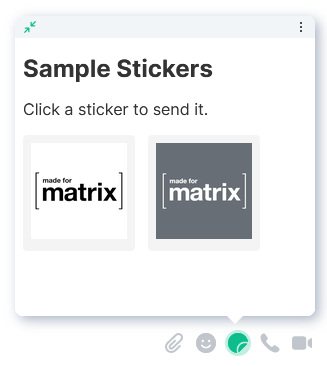

# Simple Stickerpicker Widget

This is an example of a simple stickerpicker widget to demonstrate the
concepts of widgets.

To follow along, please see the guide. **TODO: Link**

If everything goes according to plan, you'll end up with a widget like this:

